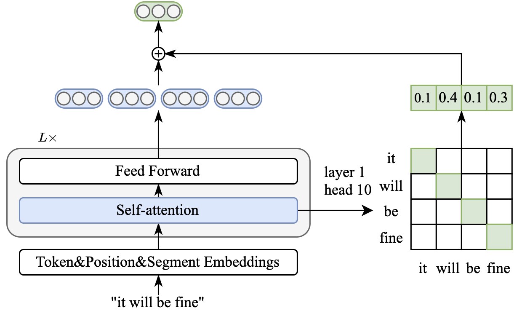

# Ditto, Ditto: A Re-Implementation of a Simple and Efficient Approach to Improve Sentence Embeddings
Steps for Reproducing the results found in the reproduction paper of Ditto:
1. Clone the repository
```shell
git clone https://github.com/AddisFlower/ditto.git
```
2. Install conda if not on the current system, else simply create the new conda environment (note: this step can be performed at any desired folder location of the user)
```shell
wget https://repo.continuum.io/miniconda/Miniconda3-latest-Linux-x86_64.sh
sh Miniconda3-latest-Linux-x86_64.sh
conda create -n ditto python=3.7
conda activate ditto
```
3. Install necessary packages (note: this step assumes that you have navigated to the root directory of the repository)
```shell
cd ditto
pip install torch==1.7.1+cu110 -f https://download.pytorch.org/whl/torch_stable.html
pip install -r requirements.txt
```
4. Download the necessary datasets (note: this step assumes you are currently in the inner ditto folder of the repository)
```bash
cd SentEval/data/downstream/
bash download_dataset.sh
```
5. To replicate the results found in Table 2 of the reproduction paper (note: this code snippet assumes that the user is utilizing 1 GPU)
```bash
cd ../../../
bash learning_free_experiments.sh
```

Steps for reproducing and comparing the average scores for our implementation of BERT first-last TF-IDF and BERT first-last Ditto

Note: These steps assume that you are currently in the root folder of the repository. Also, you should have downloaded the wikipedia dataset from this [link](https://huggingface.co/datasets/princeton-nlp/datasets-for-simcse/resolve/main/wiki1m_for_simcse.txt) and put it in the inner ditto folder.

1. To get the average score of our implementation of BERT first-last Ditto, simply run the below commands after confirming that the argument "--pooler" is set to "att_first_last" in the run_eval_ditto.sh file.
```shell
cd ditto
sh run_eval_ditto.sh
```

2. To get the average score of our implementation of BERT first-last TF-IDF, first run the below command to get a json file with the dictionary of TF-IDF weights.
```shell
python tfidf.py
```

3. Change the argument "--pooler" to "tfidf_first_last" in the run_eval_ditto.sh file and then run the command below.
```shell
sh run_eval_ditto.sh
```

Steps for reproducing the average scores for our implementation of MBERT first-last TF-IDF on the STSBenchmark dataset translated to the four languages.
1. The first step is to extract random sentences from wikipedia in the target language. Set the "language" variable at the top of the create_sentences.py file to the language you want to create the TF-IDF weights for. The "language" variable can be set to any of these values: ['pt', 'es', 'fr', 'it']. After that, simply run the command below.
```shell
python create_sentences.py
```

2. The second step is to create the TF-IDF weights using the sentences you created from the previous command. You first have to modify the "language" variable in the tfidf.py file to be the same value as the one you set in the create_sentences.py. After that, simply run the command below.
```shell
python tfidf.py
```

3. The last step is to create the sentence embeddings using these TF-IDF weights. Before running the command below however, make sure to set the "lan" variable in the tfidf_implementation_fr.py file to be to the same value you set in the previous two files. This will result in the average score of these embeddings on the STSBenchmark dataset translated to the language you chose.
```shell
python tfidf_implementation_fr.py
```

## Acknowledgement
We utilized/referenced a large amount of code from the Ditto paper's authors.


# Ditto: A Simple and Efficient Approach to Improve Sentence Embeddings

This repository contains the code for our EMNLP 2023 paper [Ditto: A Simple and Efficient Approach to Improve Sentence Embeddings](https://arxiv.org/abs/2305.10786). 

## Overview
Prior studies diagnose the anisotropy problem in sentence representations from pre-trained language models, e.g., BERT, without fine-tuning. Our analysis reveals that the sentence embeddings from BERT suffer from a bias towards uninformative words, limiting the performance in semantic textual similarity (STS) tasks. To address this bias, we propose a simple and efficient unsupervised approach, Diagonal Attention Pooling (Ditto), which weights words with model-based importance estimations and computes the weighted average of word representations from pre-trained models as sentence embeddings. Ditto can be easily applied to any pre-trained language model as a postprocessing operation. Compared to prior sentence embedding approaches, Ditto does not add parameters nor requires any learning. Empirical evaluations demonstrate that our proposed Ditto can alleviate the anisotropy problem and improve various pre-trained models on the STS benchmarks.



## Installation
### Clone the repo

```shell
git clone https://github.com/alibaba-damo-academy/SpokenNLP.git
```

### Install Conda

```shell
wget https://repo.continuum.io/miniconda/Miniconda3-latest-Linux-x86_64.sh
sh Miniconda3-latest-Linux-x86_64.sh
conda create -n ditto python=3.7
conda activate ditto
```

### Install other packages
```shell
cd SpokenNLP/ditto
pip install torch==1.7.1+cu110 -f https://download.pytorch.org/whl/torch_stable.html
pip install -r requirements.txt
```


## Evaluation

Before evaluation, please download the evaluation datasets by running
```bash
cd SentEval/data/downstream/
bash download_dataset.sh
```

Then come back to the root directory, you can evaluate any `transformers`-based pre-trained models using our evaluation code. For example,
```bash
bash run_eval_ditto.sh
```

## Citing
If this project are helpful to your research, please cite:

```shell
@article{chen2023ditto,
  author       = {Qian Chen and
                  Wen Wang and
                  Qinglin Zhang and
                  Siqi Zheng and
                  Chong Deng and
                  Hai Yu and
                  Jiaqing Liu and
                  Yukun Ma and
                  Chong Zhang},
  title        = {Ditto: A Simple and Efficient Approach to Improve Sentence Embeddings},
  booktitle    = {EMNLP 2023},
  year         = {2023},
  publisher    = {Association for Computational Linguistics},
}
```

## Acknowledgement
We borrowed a lot of code from [SimCSE](https://github.com/princeton-nlp/SimCSE).

## License
This ditto project is developed by Alibaba and based on the SimCSE project
Code is distributed under the MIT License.
This project contains various third-party components under other open source licenses. 
See the NOTICE file for more information.